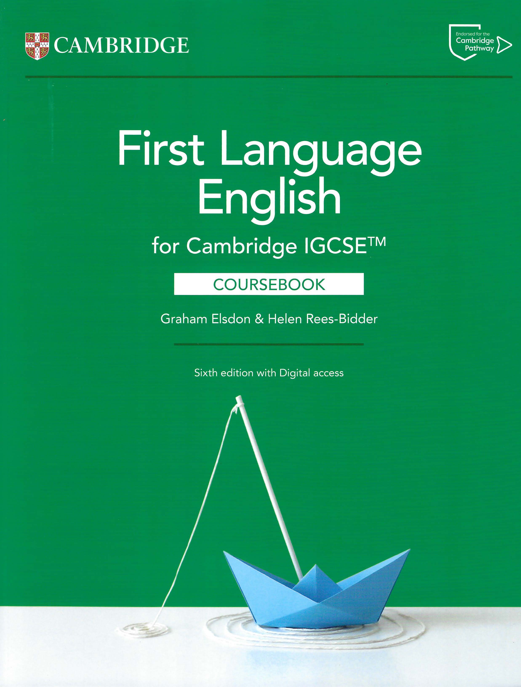
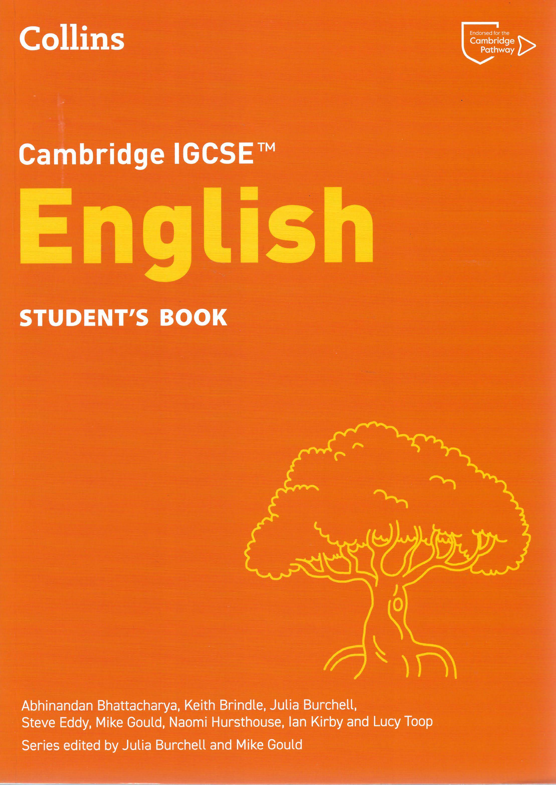
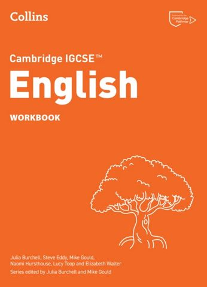
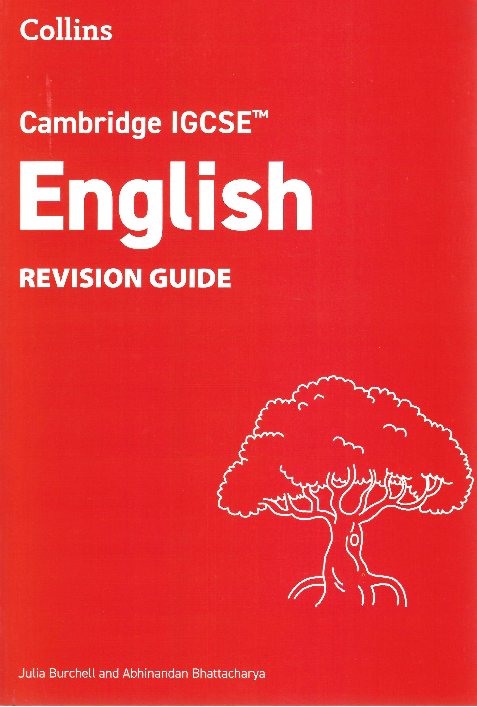
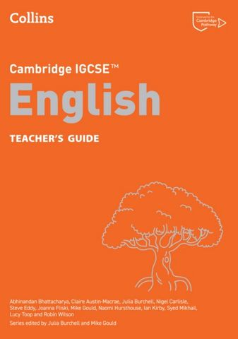
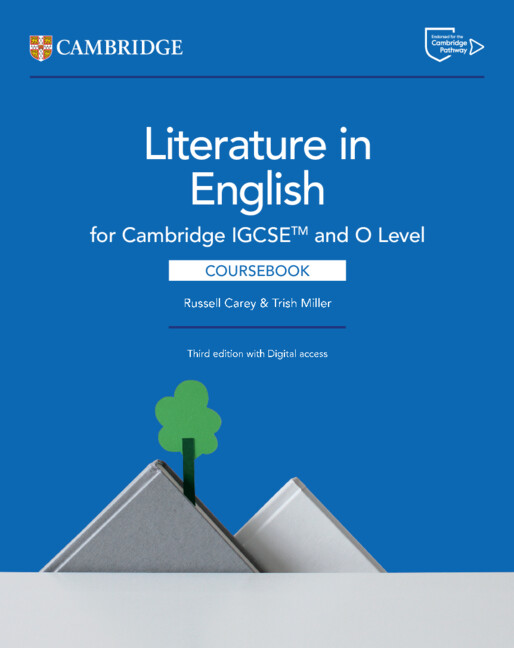
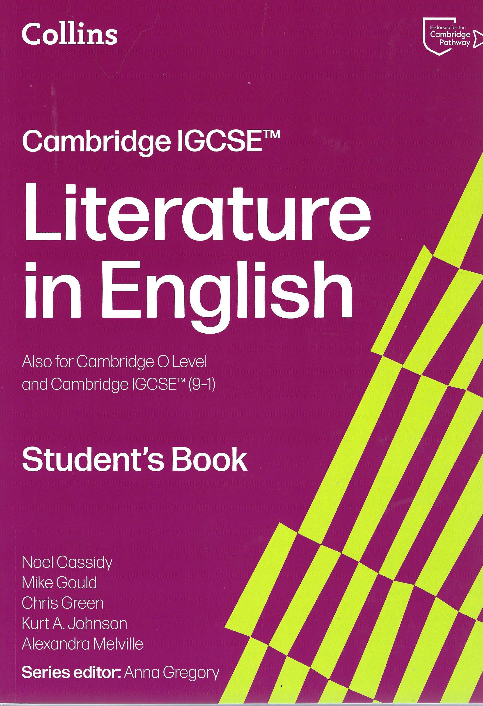
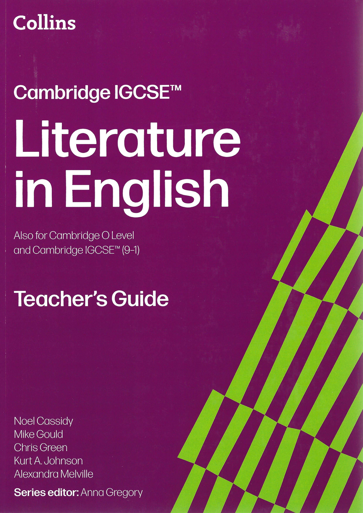
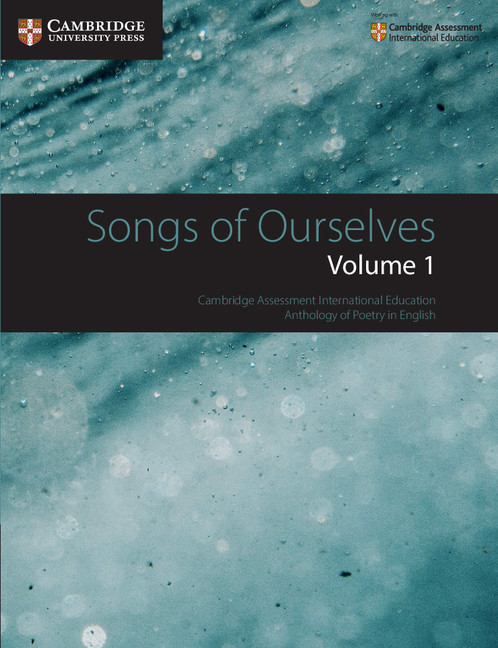

{:width="500px" style="display:block; margin:0 auto;"}

## Cambridge iGCSE English Resources (0500/0990 & 0475/0992/2010)

**High-quality searchable PDFs** of the official coursebooks, workbooks, and teacher guides — professionally digitised from the original physical books with full OCR.

These are the exact endorsed resources for the current Cambridge syllabuses and represent excellent value compared to the combined original RRP of over **£290**.

---

### Perfect for Homeschoolers, Private Tutors & International Schools

These fully searchable PDFs are **AI-analysis ready** (you can easily search, copy text, highlight, and use with AI tools for lesson planning, essay feedback, or personalised study).

- **0500 / 0990 First Language English** (exams from 2027):  
  [500](https://www.cambridgeinternational.org/programmes-and-qualifications/cambridge-igcse-english-first-language-0500/) | [9-1 (0990)](https://www.cambridgeinternational.org/programmes-and-qualifications/cambridge-igcse-9-1-first-language-english-0990/)

- **0475 / 0992 / 2010 Literature in English** (exams from 2028, including O Level pathway):  
  [0475](https://www.cambridgeinternational.org/programmes-and-qualifications/english-literature-0475/) | [9-1 (0992)](https://www.cambridgeinternational.org/programmes-and-qualifications/cambridge-igcse-english-literature-0992/) | [2010](https://www.cambridgeinternational.org/programmes-and-qualifications/cambridge-o-level-literature-in-english-2010/)

The **Collins Cambridge series** is especially popular among homeschoolers and private educators for its clear structure, practical activities, and strong scaffolding that works very well alongside the core Cambridge University Press books.

Instant digital delivery + full searchability makes these ideal for flexible learning environments.

---

## Bundle Offers (Best Value)

Save significantly compared to buying individually (combined original RRP over £290):

- **0500 / 0990 First Language English Full Set** (5 books) — **£38** / **$50**
- **0475 / 0992 / 2010 Literature in English Full Set** (3 books) — **£28** / **$37**
- **Complete 8-Book Library** (0500/0990 + 0475/0992/2010) — **£58** / **$76.50** (Best Value)

**Instant digital delivery** — no shipping costs, no waiting, no postal risks, and no heavy books to carry.

---

## 0500 First Language English

These titles support the **Cambridge IGCSE First Language English** syllabuses **(0500 / 0990)** for examination from **2027**.  

The course develops learners’ ability to communicate clearly, accurately and effectively in both speech and writing, while building strong analytical and reading skills.

| Cover | Title | Syllabus | ISBN | Scan Details | File Size | Price | Sample |
|-------|-------|----------|------|--------------|-----------|-------|--------|
| [{:width="110px"}](9781009528795.jpg) | Cambridge IGCSE™ First Language English Coursebook – Graham Elsdon | **0500 / 0990** | [9781009528795](https://www.cambridge.org/gb/education/subject/english/cambridge-igcse-first-language-english-6th-edition/cambridge-igcse-first-language-english-6th-edition-coursebook-digital-access-2-years-digital-coursebook-2-years?isbn=9781009528795&format=DO) | Colour – Flatbed Scanner | 154 MB | **£10** / **$13.20** | [View Sample](https://mega.nz/file/oBVSVbCZ#C0d6SiJ8hZuAjYILNT4od-AXhgdqEBOHrrOB6cfltGw) |
| [{:width="110px"}](9780008700553.jpg) | Cambridge IGCSE™ English Student's Book (Collins) – Abhinandan Bhattacharya | **0500 / 0990** | [9780008700553](https://collins.co.uk/products/9780008700553) | Colour – Flatbed Scanner | 234 MB | **£8** / **$10.50** | [View Sample](https://mega.nz/file/cV1AzbyJ#bSHyNMolzTPc5jxbiB5AhcxBN5SLRyePe3stQBUqAlw) |
| [{:width="110px"}](9780008700560.jpg) | Cambridge IGCSE™ English Workbook (Collins) – Julia Burchell | **0500 / 0990** | [9780008700560](https://collins.co.uk/products/9780008700560) | **Black & White – Camera Scan** | 85 MB | **£5** / **$6.60** | [View Sample](https://mega.nz/file/IUU13KwQ#FWsgKEyzwF4eWsmtImPGz-sK85nqehkkafJr4b52c4g) |
| [{:width="110px"}](9780008758899.jpg) | Cambridge IGCSE™ English Revision Guide (Collins) | **0500 / 0990** | [9780008758899](https://collins.co.uk/products/9780008758899) | Colour – Flatbed Scanner | 87 MB | **£6** / **$7.90** | [View Sample](https://mega.nz/file/FM92DSpb#3m0vu3EAXCIf8CdhTmOYcW56E0wQqthtuECU4DRNDSM) |
| [{:width="110px"}](9780008700577.jpg) | Cambridge IGCSE™ English Teacher's Guide (Collins) – Abhinandan Bhattacharya | **0500 / 0990** | [9780008700577](https://collins.co.uk/products/9780008700577) | **Black & White – Camera Scan** | 176 MB | **£20** / **$26.40** | [View Sample](https://mega.nz/file/9R1VXYbS#grUc6uOBTxwWAPLZedilUrf3WKr2_Qc0P1REh_gC1xo) |
---

## 0475 Literature in English

These titles support the **Cambridge IGCSE Literature in English** syllabuses **(0475 / 0992 / 2010)** for examination from **2028** (including O Level pathway).  

Learners develop the ability to read, interpret and evaluate literary texts, understand deeper themes and contexts, and respond personally and critically to a wide range of literature.

| Cover | Title | Syllabus | ISBN | Scan Details | File Size | Price | Sample |
|-------|-------|----------|------|--------------|-----------|-------|--------|
| [{:width="110px"}](9781009522724.jpg) | Cambridge IGCSE™ and O Level Literature in English Coursebook – Russell Carey | **0475 / 0992 / 2010** | [9781009522724](https://www.cambridge.org/gb/education/subject/english/english-literature/cambridge-igcse-and-o-level-literature-english-3rd-edition/cambridge-igcse-and-o-level-literature-english-3rd-edition-coursebook-digital-access-2-years-digital-coursebook-2-years?format=DO&isbn=9781009522724) | Colour – Flatbed Scanner | 160 MB | **£10** / **$13.20** | [View Sample](https://mega.nz/file/YQkBkQrT#DqQAtY_bvoLcfkhwB2fbPfdT5eoY374GMRDU2REItK4) |
| [{:width="110px"}](9780008781194.jpg) | Cambridge IGCSE™ Literature in English Student's Book (Collins) – Noel Cassidy | **0475 / 0992 / 2010** | [9780008781194](https://collins.co.uk/products/9780008781194) | Colour – Flatbed Scanner | 176 MB | **£8** / **$10.50** | [View Sample](https://mega.nz/file/dEcWALqZ#r7QXm8l9wzskzyF_44LXaG_vk2wbM-eFgD8GPFSmKr0) |
| [{:width="110px"}](9780008781200.jpg) | Cambridge IGCSE™ Literature in English Teacher's Guide (Collins) – Anna Gregory | **0475 / 0992 / 2010** | [9780008781200](https://collins.co.uk/products/9780008781200) | **Black & White – Camera Scan** | 156 MB | **£20** / **$26.40** | [View Sample](https://mega.nz/file/UcFi0QJC#rgoVnUEAIprvjGuO_KPaid5qS9H8ngcd2V_lPg4m7Bg) |

---

## How to Purchase

Payments are **secure** and card payments are possible via a trusted third-party platform. Easy payment instructions will be provided promptly over email.

I’m a fellow educator with a strong passion for educational excellence and accessibility. I’m happy to offer **flexible pricing** and special deals for students, homeschooling families, and teachers who may need support.

**Contact me directly** for bundle options, sample files, full resources, and instant delivery. I usually reply within a few hours.

**EMAIL:** [IGCSE.FLAGSTONE491@PASSFWD.COM](mailto:IGCSE.FLAGSTONE491@PASSFWD.COM)

**Instant digital delivery** — no waiting, no shipping costs, no postal risks.

---

## Optional Free Study Resources (for 0475 / 0992 / 2010)

The following texts are commonly used as set texts or supplementary material for Cambridge IGCSE Literature in English. These are provided as free optional downloads.

| Cover | Title | Syllabus | ISBN | Details | File Size |
|-------|-------|----------|------|---------|-----------|
| {:width="110px"} | Songs of Ourselves, Volume 1 (Selected 15 Poems) | **0475 / 0992 / 2010** | 9781108462266 | Cambridge University Press Anthology. Includes: Shakespeare (Sonnet 18), Aphra Behn, Katherine Philips, William Blake, Alexander Pope, Carol Rumens, Charles Mungoshi, Liz Lochhead, Gillian Clarke, Boey Kim Cheng, Sujata Bhatt, Judith Wright, Kevin Halligan, Elizabeth Brewster, Seamus Heaney. | ~ MB |
| {:width="110px"} | Pride and Prejudice | **0475 / 0992 / 2010** | 978-1-59308-201-7 | Jane Austen (Barnes & Noble Classics edition) – One of the most popular prose texts for Cambridge Literature. | ~ MB |
| {:width="110px"} | The Importance of Being Earnest | **0475 / 0992 / 2010** | 0140436068 | Oscar Wilde (Penguin Classics edition) – Classic comedy play frequently studied in the syllabus. | ~ MB |

---

*These are professionally scanned and enhanced digital editions. You are paying for the considerable time, effort, and expertise involved in sourcing the physical books, high-quality scanning, OCR processing, consistent formatting, and secure delivery of these otherwise expensive and hard-to-access learning materials. Intended for personal educational use only.*
